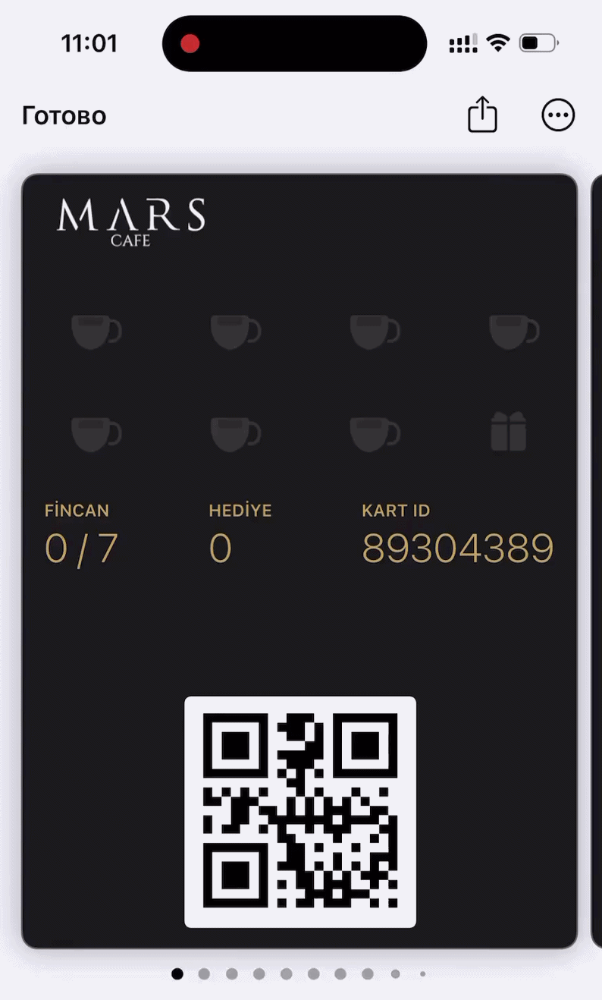
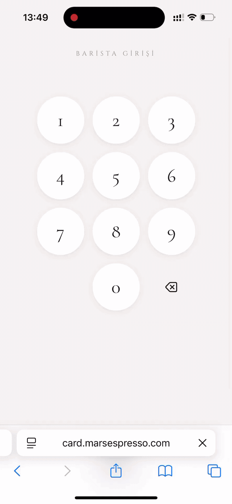

# ☕️ Mars Loyalty Card

Digital loyalty card system for **Mars Coffee & Kitchen** café (Istanbul).  
Built to replace paper stamp cards — guests collect cups in Apple Wallet or as a web app on Android.

---

## ✨ Features

- **Apple Wallet card** — real PassKit `.pkpass`, added to iPhone with one tap  
- **Push notifications** — card updates instantly when barista adds a cup (no manual refresh)  
- **Barista interface** — `barista.html`: scan or search guest, add cups, track free drink rewards  
- **Android PWA** — `card.marsespresso.com` installable as home screen app via manifest.json  
- **Supabase backend** — guests, cup counts, and push tokens stored in PostgreSQL  
- **Serverless API** — all endpoints deployed on Vercel (Node.js)

---

## 🛠 Tech Stack

| Layer | Tech |
|---|---|
| Frontend | HTML, CSS, Vanilla JS |
| Backend | Node.js, Vercel Serverless Functions |
| Database | Supabase (PostgreSQL) |
| Wallet | Apple PassKit (pkpass + push) |
| PWA | Web App Manifest (Android) |

---

## 📸 Screenshots

#### Apple Wallet card

#### Barista interface

#### Demo GIF
<!--  -->

---

## 🔐 Notes

- SSL certificates and private keys are not stored in this repo (`certs/` is in `.gitignore`)  
- Push notifications use Apple APNs — requires valid `.p8` key configured in environment variables

---

## 💡 Built with

Designed and developed by [@nastya-lomastya](https://github.com/nastya-lomastya)  
AI-assisted development with Claude (Anthropic)
